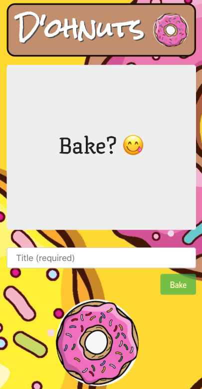
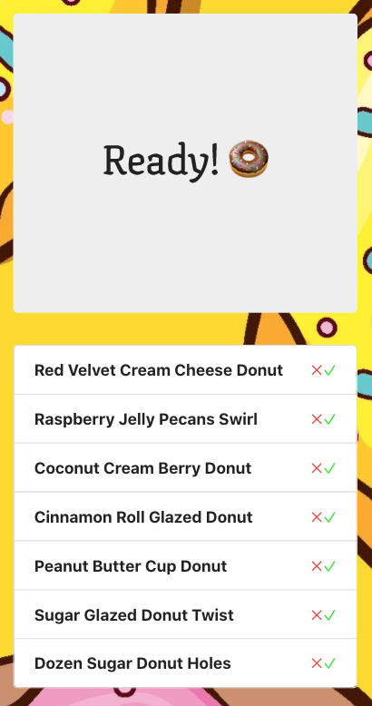

## D'ohnuts!
<!--  -->

## Description
An interactive tribute to Homer Simpson and his love for donuts. Envision yourself as Homer Simpson and Create any donut you can imagine. Read and Update existing donut recipies or Delete secret recipies!

## Table of Contents    
* [Quick Start](#quick-start)
* [Installation](#Installation)
* [Usage](#usage)
* [Screenshots](#screenshots)
* [Questions](#questions)  
* [License](#lisence)

## Quick Start
Homer Simpson is craving the most mouthwatering, outrageous donut you can imagine. Begin by typing a custom donut title in the "Bake Donuts" section then click "Bake." After successfully submitting your recipe, your donut will appear in the "Ready,yum" category where you may chose to eat it, by selecting the checkmark, or save it for later! After a donut has been consumed, it will move over to the "Gone Donuts" column and await the user to re-submit, or delete the recipe.

*Future Development: Allow users to generate random donut recipes*

## Installation
To install the application locally and edit the code, follow the steps below:
1. Clone the repository to the desired location using your terminal using "git clone <git@github.com:YOUR-USERNAME-HERE/dohnuts-v2.git>"
2. After succesful cloning, open the repository in your code editor and run npm install to install all required dependencies
3. To populate the database, run the seed script using "npm run seed" in the top level folder
4. After poplating the database, begin the application by running the start commant or "npm start" which will prompt server to start on localhost

## Usage
Allow your inner baker to dream up custom donut recipes. Create a list of desired donuts to try or favorite donut flavors.
      
## Screenshots
### Web Application:

### Mobile Application:

### No Match Page:

<!-- ## Technologies Used
* [GitHub](https://www.github.com/)
* [Heroku](https://www.heroku.com/)
* [MockFlow Wireframe](https://www.mockflow.com/)
* [MongoDB Atlas](https://www.mongodb.com/cloud/atlas)
* [Postman- Route Testing](https://www.postman.com/)
* [React](https://reactjs.org/)
* [React-bootstrap](https://react-bootstrap.github.io/)
* [Travis CI](https://travis-ci.org/) -->

## Questions
### Lisbeth Machado
* :octocat: [GitHub: https://github.com/lisbethmachado](https://github.com/lisbethmachado)
* 📧 E-mail: lisbeth.webdev@gmail.com

For repository and more information visit [Github](http://www.github.com/lisbethmachado). You may contact us via [E-mail](mailto:lisbeth.webdev@gmail.com) with questions or suggestions. Thank you for your interest!

## License
<!-- Copyright 2020 - present Lisbeth Machado.
This project is licensed under the terms of the MIT license. 
More information is available at [opensource.org/licenses](https://opensource.org/licenses/MIT) -->